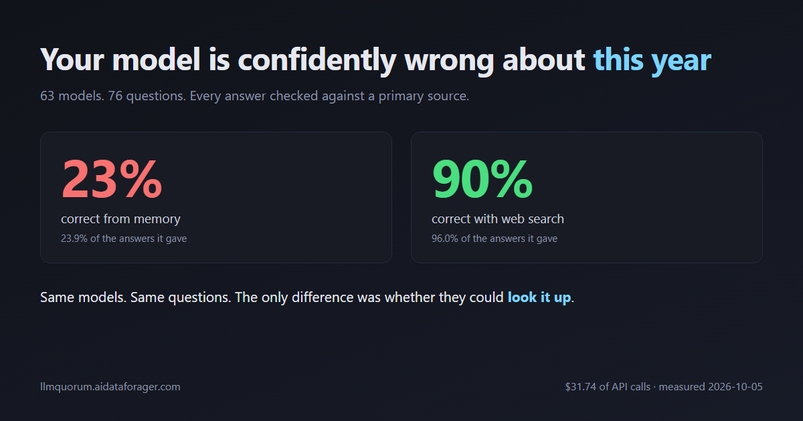

# LLMQuorum

**[llmquorum.aidataforager.com](https://llmquorum.aidataforager.com)**



Sixty-three models were asked the same seventy-six questions. Every question has one short answer that can be
checked against a primary source, and every answer the models gave was graded against it. Models that can search
were asked twice, once each way, which makes 76 seats.

**From memory they were right 23% of the time. With web search, 90%.**

Counting only the answers that actually came back, rather than calls that errored: **23.9%** and **96.0%**. Both
numbers are on the site; the gap between them is failed calls, almost all from one free seat whose search tool
kept erroring.

That is the whole finding. The rest of this repository is the machinery that makes it checkable.

Full tables, best and worst seats and the hardest questions: **[RESULTS.md](RESULTS.md)**, generated from
the database rather than typed.

## What makes the questions fair

A question earns its place only if it has a short unambiguous answer, a primary source that states that answer
(the agency, the manufacturer, the law itself), and, for the newer set, a change within the last twelve months.
The previous answers are recorded too, so a model repeating last year's figure is graded **Outdated** rather
than **Hallucinated**. Those are different failures and the report keeps them apart.

Two question sets are included:

| Set | Questions | What it covers |
| --- | --- | --- |
| Public set v2 | 22 | US payroll and tax limits, Michigan delinquent property tax, .NET, SQL Server |
| Public set v3 | 54 | 27 categories whose answers all changed within the last year: hardware prices, FDA rules, cosmetics, supplements, OSHA, DOL, USCIS, Medicare, SEC, CFPB, crypto, student loans, AI law, state privacy, EPA |

## How a run works

- `profiles.json` defines every seat: a model, the endpoint it is pinned to, how it is asked, and for paid
  seats its prices and limits. A model asked both from memory and with web search is two seats, which is the
  comparison the whole harness exists to make.
- `SweepRunner` asks each seat the same prompt, and `ResponseExtractor` turns each raw response into a verdict
  from the bytes alone, so a rule change re-grades history instead of re-spending money.
- `PlanRunnerJob` works through a plan slowly and in order, one question per provider group per pass, waiting
  out daily caps. It ran for days without supervision.
- Every raw response is stored. Grades are rebuilt from those bytes, never from a summary.

## Spending real money without trusting the code

Paid models bill per call and native web search cannot be bounded per request, so the money rules are separate
from the calling code and assume the calling code is wrong:

- A reservation row is written **before** the request goes out. Any reservation means that seat was asked for
  that question, permanently, whatever it settled at. Nothing re-asks it automatically.
- One send per seat. The only exception is a rejection OpenRouter documents as happening before any provider
  ran, which provably bills nothing.
- **Reconcile:** the key's own lifetime usage at OpenRouter may never exceed what the ledger accounts for. If it
  does, something billed that was not recorded and the lane halts until a human clears it.
- A halt is written to the database *and* to a file, so it survives a database that was unreachable at the
  moment it had to be raised.
- Every refusal names itself in the plan note: which seat, why, and what it would take to continue.

The complete run of 76 questions across 21 paid seats cost **$31.74**, metered by OpenRouter, against a ledger
that recorded $38.22 because it deliberately over-records. It never overspent and never asked a seat twice.

## Layout

```
LLMQuorum.Core/Sweep/     the harness: profiles, calling, extraction, grading, plan rules, spend gate
LLMQuorum.Web/            portal, background jobs, and the published report site under wwwroot/report
LLMQuorum.Tests/          235 tests, most of them money rules and extraction edge cases found in live runs
Schema/                   every database change in order, each one explaining why it exists
questions/               the question sets with their sources
ops/                      watchdog, export and packaging scripts
```

## Running it

Needs .NET 10 and SQL Server. Apply `Schema/*.sql` in order, put provider keys in `keys/` (git-ignored, one
file per provider), and run `LLMQuorum.Web`. The portal is at `http://localhost:5199`, the report at
`/report/`, and the Hangfire dashboard at `/jobs`.

`ops/export-site.ps1` freezes the current results into the JSON the published site reads, so what is published
is a snapshot with no database behind it.

Built by Dan Weaver. MIT licensed.
